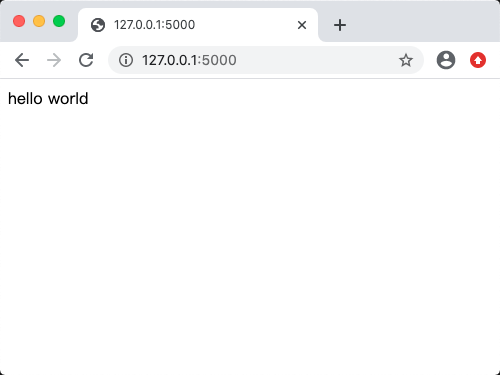

## Flask简介

[TOC]

### 1 Flask的基本介绍
Flask 是一个用Python编写的Web应用程序框架，由 Armin Ronacher 开发


### 2 Flask应用测试
在编辑器中输入以下代码：

```Python
from flask import Flask
app = Flask(__name__)

@app.route('/')
def hello_world():
   return 'hello world'

if __name__ == '__main__':
   app.run()
```

Flask类的**route()**函数是一个装饰器，它告诉应用程序哪个URL应该调用相关的函数。


>  **运行结果如下**：



### 3 测试程序说明
 <font color = red> **app.route(rule, options)** </font>
 - **rule:** 参数表示与该函数的URL绑定
 - **options:** 是要转发给基础Rule对象的参数列表

在上面的示例中，'/ ' URL与**hello_world()**函数绑定。因此，当在浏览器中打开web服务器的主页时，将呈现该函数的输出。

最后，Flask类的**run()**方法在本地开发服务器上运行应用程序。

```python
app.run(host, port, debug, options)
```

#### 分解示例 Flask 程序
1. 首先我们从`flask`包导入`Flask`类，通过实例化这个类，创建一个程序对象app:
``` python
from flask import Flask
app = Flask(__name__)
```

接下来，我们要注册一个处理函数，这个函数是处理某个请求的处理函数，Flask 官方把它叫做视图函数（view funciton），你可以理解为“请求处理函数”。

所谓的“注册”，就是给这个函数戴上一个装饰器帽子。我们使用 app.route() 装 饰器来为这个函数绑定对应的 URL，当用户在浏览器访问这个 URL 的时候，就会 触发这个函数，获取返回值，并把返回值显示到浏览器窗口：

``` python
@app.route('/')
def hello_world():
   return 'hello world'
```

> 提示 为了便于理解，你可以把 Web 程序看作是一堆这样的视图函数的集合： 编写不同的函数处理对应 URL 的请求。


填入 `app.route()` 装饰器的第一个参数是URL规则字符串，这里的` / `指的是根地址。

> 我们只需要写出相对地址，主机地址、端口号等都不需要写出。所以说，这里的 / 对应的是主机名后面的路径部分，完整 URL 就是 http://localhost:5000/。如果 我们这里定义的 URL 规则是 /hello ，那么完整 URL 就是 http://localhost:5000/hello 。


整个请求的过程如下所示:

1. 当用户在浏览器地址访问这个地址，在这里即：http://localhost:5000/
2. 服务器解析请求，发现请求URL匹配的URL规则是 `/`，因此调用对应的处理函数`hello()`
3. 获取`hello()`函数的返回值，处理后返回给客户端(浏览器)
4. 浏览器接受响应，将其显示在窗口上


### 4 程序发现机制

如果你把上面的程序保存成其他的名字，比如 `hello.py`，接着执行 `flask run` 命 令会返回一个错误提示。这是因为 Flask 默认会假设你把程序存储在名为 `app.py` 或 `wsgi.py` 的文件中。如果你使用了其他名称，就要设置系统环境变量 `FLASK_APP` 来告诉 `Flask` 你要启动哪个程序。

`Flask` 通过读取这个环境变量值对应的模块寻找要运行的程序实例，你可以把它设 置成下面这些值：

- 模块名
- Python 导入路径
- 文件目录路径


### 5 管理环境变量

现在在启动 Flask 程序的时候，我们通常要和两个环境变量打交道： `FLASK_APP` 和 `FLASK_ENV` 。因为我们的程序现在的名字是 `app.py`，暂时不需要设置 `FLASK_APP` ； `FLASK_ENV` 用来设置程序运行的环境，默认为 `production` 。 在开发时，我们需要开启调试模式`（debug mode）`。调试模式可以通过将系统环 境变量 `FLASK_ENV` 设为 `development` 来开启。调试模式开启后，当程序出 错，浏览器页面上会显示错误信息；代码出现变动后，程序会自动重载。

为了不用每次打开新的终端会话都要设置环境变量，我们安装用来管理系统环境变 量的 `python-dotenv`：

``` (env) $ pip install python-dotenv ```

当 `python-dotenv` 安装后，`Flask` 会从项目根目录的` .flaskenv` 和` .env `文件读取环境变量并设置。我们分别使用文本编辑器创建这两个文件，或是使用更方便的`touch`命令创建：

` $ touch .env .flaskenv `

` .flaskenv` 用来存储 Flask 命令行系统相关的公开环境变量；而 `.env `则用来存储敏 感数据，不应该提交进Git仓库.

在新创建的 ` .flaskenv` 文件里，我们写入一行` FLASK_ENV=development `，将环境 变量 `FLASK_ENV` 的值设为 `development` ，以便开启调试模式：

` FLASK_ENV=development `

